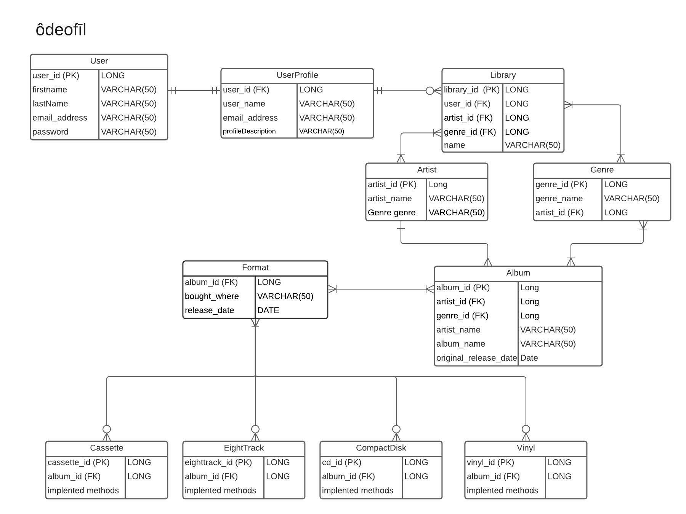
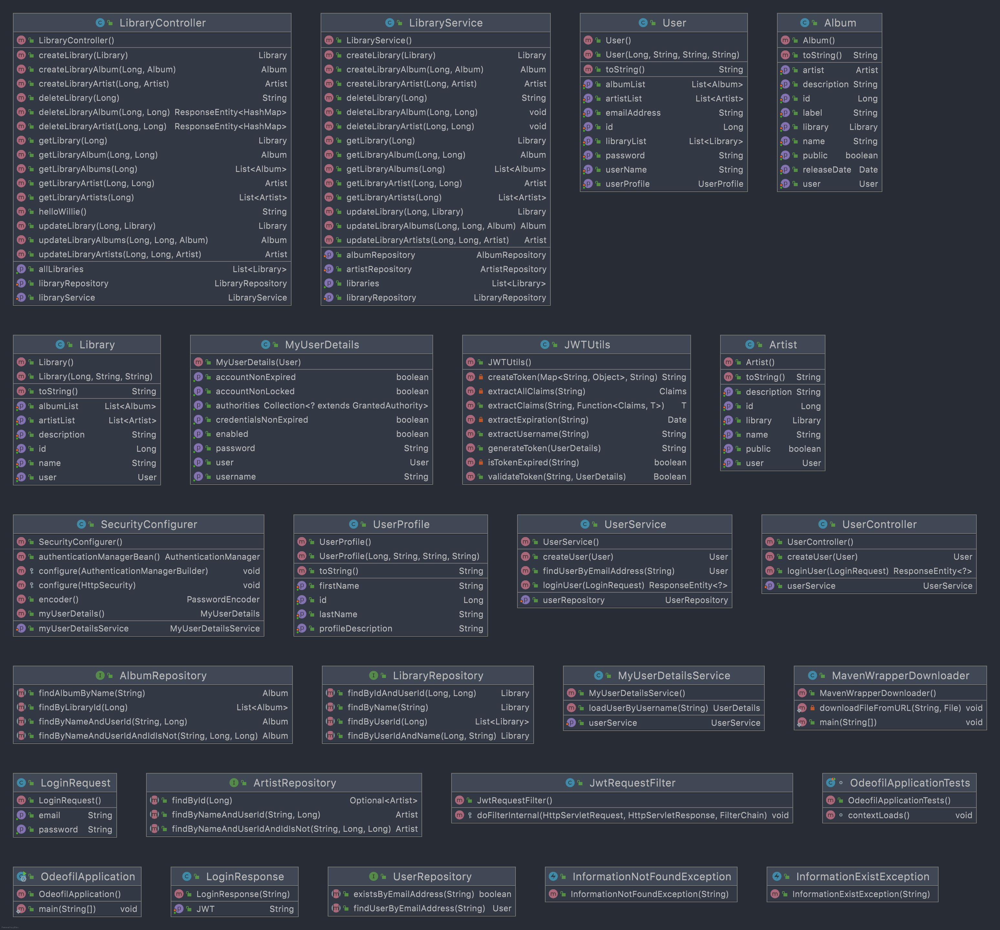

#### paypal-java-project-2

# ôdeofīl  
_AH-dee-oh-FIE-uhl_
_**A place for people to organize and share their personal physical music collection.**_

## ERD Diagram

### User Stories 
**(Bronze)**  
• As a user, I should be able to create an account  
• As a user, I should be able to log into my account  
• As a user, I should be able to add music to my library  
• As a user, I should be able to search my library  
• As a user, I should be able to view my library  
• As a user, I should be able to remove music from my library  

**(Silver)**  
• As a user, I should be able to search the music database for a specific release  
• As a user, I should be able to view my friends’ libraries  
• As a user, I should be able to comment on my friends’ libraries  
• As a user, I should be able to keep a wish list of music copies I want to collect  

**(Gold)**  
• As a user, I should be able to trade my music copies with friends  
• As a user, I should be able to save a pending release for when it comes out  
• As a user, I should be able to see where local music shops are (Google Map API)  

**(Platinum/Diamond)**  
• As a user I should be able to share my purchase on social media  
• As a user I should be able to share my wish list on social media  
• As a user, I should be able to talk with friends in real time  

## HTTP Path Mappings
| **HTTP REQUEST** | **PATH** | **DESCRIPTION** |
| ---------------- | -------- | --------------- |
| GET | /api/libraries/ | Retrieve all libraries |  
| POST | /api/libraries/ | Create a library |  
| GET | /api/libraries/{libraryId} | Retrieve a single library |  
| PUT | /api/libraries/{libraryId} | Update a library |
| DELETE | /api/libraries/{libraryId} | Delete a library |
| GET | /api/libraries/{libraryId}/albums | Retrieve all albums in a library |
| POST | /api/libraries/{libraryId}/albums | Add an album to the library |
| GET | /api/libraries/{libraryId}/albums/{albumId} | Retrieve a single album |
| PUT | /api/libraries/{libraryId}/albums/{albumId} | Update an album |
| DELETE | /api/libraries/{libraryId}/albums/{albumId} | Delete an album |
| GET | /api/libraries/{libraryId}/artists | Retrieve all artists in a library |
| POST | /api/libraries/{libraryId}/artists | Add an artist to the library |
| GET | /api/libraries/{libraryId}/artists/{artistId} | Retrieve a single artist |
| PUT | /api/libraries/{libraryId}/artists/{artistId} | Update an artist |
| DELETE | /api/libraries/{libraryId}/artists/{artistId} | Delete an artist |
| POST | /auth/users/login | Login to the app |
| POST | /auth/users/register | Create a user profile |

## Technology Used
• Spring Boot, Java, Maven in IntelliJ  
• LucidApp  
• Postman  
• PostgreSQL  
• Microsoft Sharepoint (Word, Planner)  

## Our Approach:
We wanted to find a real world need to address with this project. Andy is an avid vinyl collector but found he didn't have a way to know if he had a physical copy at home while browsing in a store. Andy's friend let him know that he accidentally bought an extra record since we started project which we found funny. We spent our first day planning on how we would proceed with the project. We found [Discogs API](https://www.discogs.com/developers) which would help us access their existing database of physical releases of music.  
 \
We utilized Microsoft Sharepoint to help us organize our plan for this project. Word allowed us to work on our User Stories' together at the same time. We also used Planner to create a digital version of a Kanban Board/To Do List to make sure we stayed on track. We created separate to do lists for various packages in the project and included an undefined package for things that did not exactly fit in the others. We enjoyed using this tool and found it could be used in future/longer term projects. It allows you to assign due date to a task and a task to an individual.

## Next Version Wants:
Our original ERD diagram from LucidApp shows different formats of music. We prioritized items in our Minimum Viable Product and realized this would be something that needed to be added later on in the project's development. We also planned on integrating Discogs' API to help users search through existing music to add to their libraries. This project was a great exercize in "keeping it simple" as we realized we could overcomplicate things by repeating ourselves. We originally were only going to allow a user to have one library. Later on, we wanted to add a feature for a Wish List but realized allowing multiple libraries would solve this issue.
\
We have researched how to implement open-source API's and this led to even more ideas of what to add to the app. We plan on utilizing our experience with adding Discogs API to use Google Maps API to only show music stores close to the user's physical location. The possibilities are endless, and we are excited to continue building this API in the future.  

## Roses :rose:, Thorns :cactus:, and Bugs :bug:  
:rose: Paired Programming helped us communicate with each other different mindsets on how to approach the project. It allowed us to identify areas of opportunity and learn together as we progressed.  
:rose: We have a better understanding of the time commitment needed for a project like this. We started at a fast, consistent pace and quickly got excited to potentially work on UI later in the project. The previously mentioned errors slowed our pace down yet helped us feel more confident in our debugging skills.  
:rose: Errors were caused by our IntelliJs' not fully fetching from the master. Not all of the changes would transfer which caused missing or repeated code in later commits. We took a step back to debug and slowly fix these errors. This helped us solidify our understanding of the structure of the project and how "minor" errors can cause major issues down the road.  
:cactus: Postman deleted all of our endpoints due to a forced update. We did not realize that, even though we saved regularly, it would delete all that we worked on.  
:cactus: Some of our endpoints are pulling too much data and causing infinite loops. This is frustrating while testing because certain classes do not exhibit the same behavior. Due to time constraints, we have not been able to find the root cause of this.  
:bug: Some id's generate automatically for the different classes. We have found certain ones do not assign an id when an object is created. We can manually add these for testing purposes but plan on prioritizing this bug in our next version.  
:bug: Postman would allow us to access some information that we created at times. Later on, it would not allow us to call the data even though we were using the same method.

